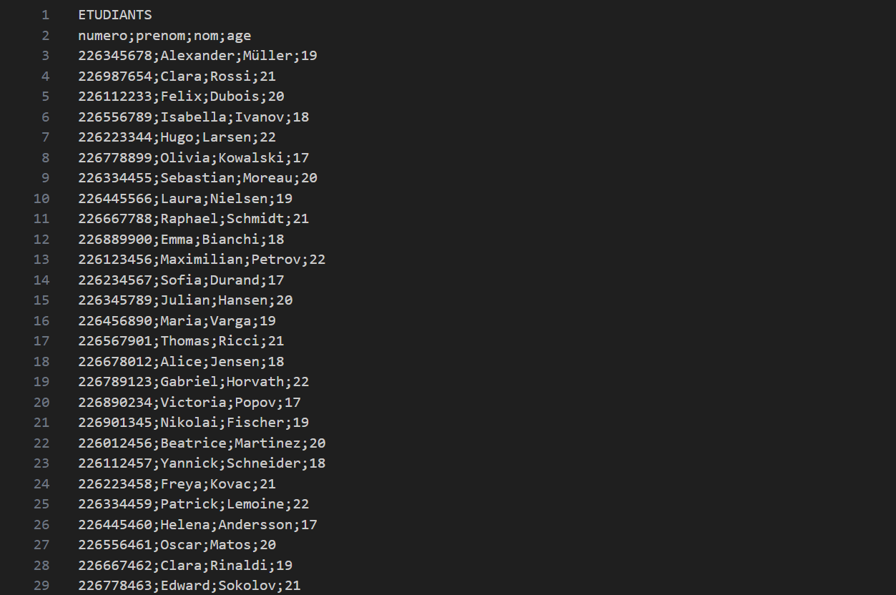
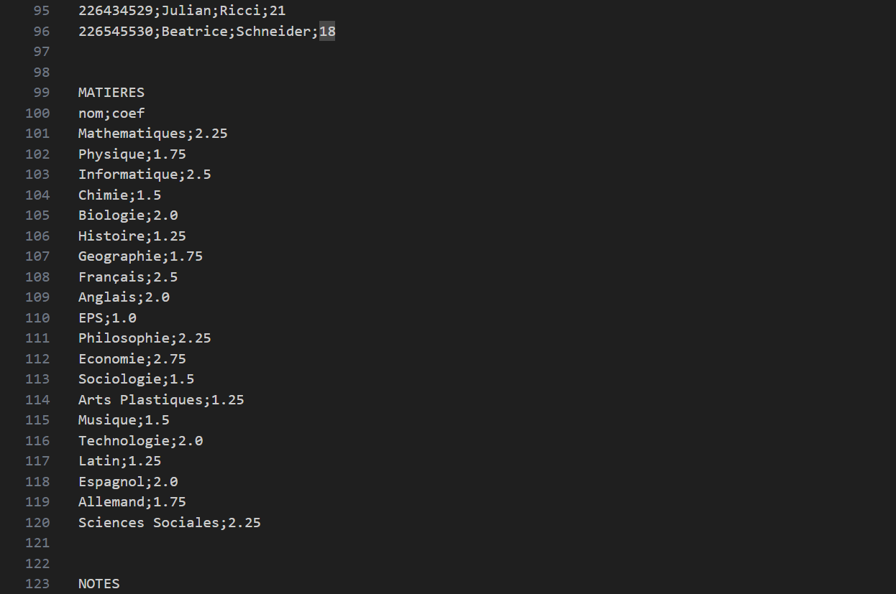
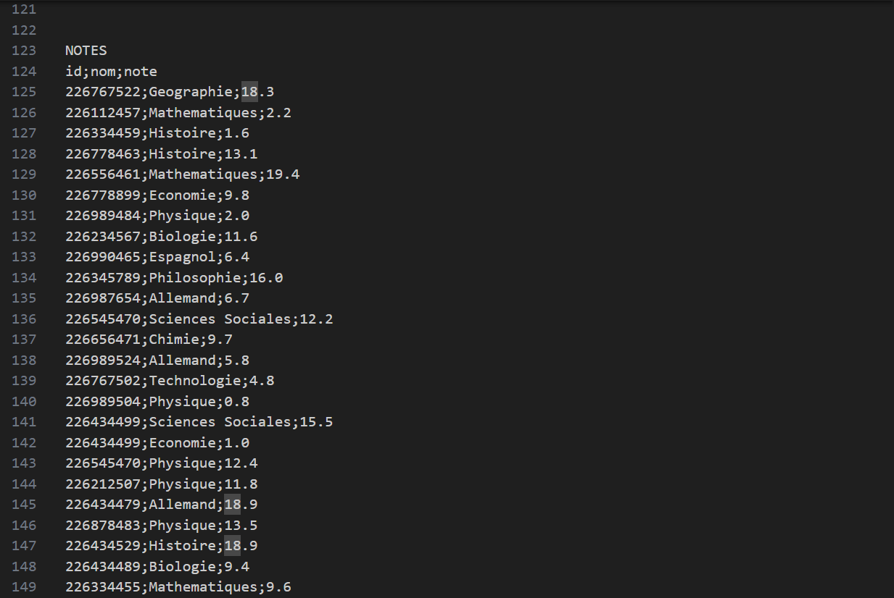

<h1 align="center">⚙ Mini-Project ⚙</h1>

## Introduction

Un mini projet en C, abordant les concepts de : structures, tableaux, chaînes de caractères, pointeurs, allocations dynamiques, arbres binaires de recherche, fichiers, compilation séparée, makefile. Le projet a pour but de stocker en mémoire les informations sur une promotion (étudiants, matières et notes) provenant d'un fichier .txt, de les sauvegarder dans des fichiers ainsi que de traiter ces données.

## Fichier d'entrée

Le fichier d'entrée (Data/data.txt) est un fichier `.txt` contenant des données sur les étudiants, les matières de la promotion ainsi que les notes. Les données sont séparées par un délimiteur `;` de la façon suivante : 

- Pour les étudiants :



- Pour les matières (Un peu plus loin dans le même fichier) : 



- Pour les notes (Un peu plus loin dans le même fichier) : 



## Prérequis

- Un **compilateur C** comme `gcc`.
- **Doxygen** pour la génération de documentation.

## Installation

1. **Installer un compilateur C comme `gcc` :** 
```sh
sudo apt update
sudo apt install gcc
```

2. **Installer Doxygen :** 
```sh
sudo apt install doxygen
```

3. **Cloner le répertoire :** 
```sh
git clone https://github.com/RayyyZen/Mini-Project.git
```

4. **Aller au répertoire du projet :** 
```sh
cd Mini-Project
```

5. **Compiler et exécuter le projet :**
```sh
make run
```
- **OU**
```sh
make && ./Mini-Project
```

6. **Pour accéder à la documentation Doxygen :**
- Sur Windows :
```sh
start Docs/html/index.html
```
- Sur Linux :
```sh
xdg-open Docs/html/index.html
```
- Sur macOS :
```sh
open Docs/html/index.html
```

## Api

### Bibliothèque statique

- Pour créer une bibliothèque statique (en étant dans le répertoire du projet) :
```sh
make api_s
```

- Pour compiler le projet depuis le dossier `Api` :
```sh
gcc main.c -I . -L . -lstudent_s -o MiniStatic
```

- Pour exécuter le projet depuis le dossier `Api` :
```sh
./MiniStatic
```

### Bibliothèque dynamique

- Pour créer une bibliothèque dynamique (en étant dans le répertoire du projet) :
```sh
make api_d
```

- Pour compiler le projet depuis le dossier `Api` :
```sh
gcc main.c -o MiniDynamic -L. -lstudent_d -Wl,-rpath=.
```

- Pour exécuter le projet depuis le dossier `Api` :
```sh
./MiniDynamic
```

## Licence

Ce projet est sous la licence BSD 2-Clause. Voir [LICENSE](LICENSE) pour plus de détails.